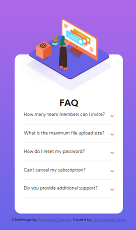

# Frontend Mentor - FAQ accordion card solution

This is a solution to the [FAQ accordion card challenge on Frontend Mentor](https://www.frontendmentor.io/challenges/faq-accordion-card-XlyjD0Oam). Frontend Mentor challenges help you improve your coding skills by building realistic projects. 

## Table of contents

- [Overview](#overview)
  - [The challenge](#the-challenge)
  - [Screenshot](#screenshot)
  - [Links](#links)
- [My process](#my-process)
  - [Built with](#built-with)
  - [What I learned](#what-i-learned)
  - [Useful resources](#useful-resources)
- [Author](#author)

## Overview

### The challenge

Users should be able to:

- View the optimal layout for the component depending on their device's screen size
- See hover states for all interactive elements on the page
- Hide/Show the answer to a question when the question is clicked

### Screenshot

### Links

- Solution URL: https://www.frontendmentor.io/solutions/faq-accordion-card-21wjVIUWb
- Live Site URL: https://omarbaltaji.github.io/faq-accordion-card-main/

## My process

### Built with

- Semantic HTML5 markup
- CSS custom properties
- Flexbox
- Mobile-first workflow

### What I learned

- How to position images properly without compromising the layout. 
- How to use "picture" tag
- How to design mobile first.

### Useful resources

- [Coder Coder - Building an accordion with HTML, CSS & JS (Part 1)](https://www.youtube.com/watch?v=FboXxLxg8eo ) - This video by Coder Coder helped me a lot when trying to position the images correctly while ensuring they are responsive.

## Author

- Frontend Mentor - [@OmarBaltaji](https://www.frontendmentor.io/profile/OmarBaltaji)